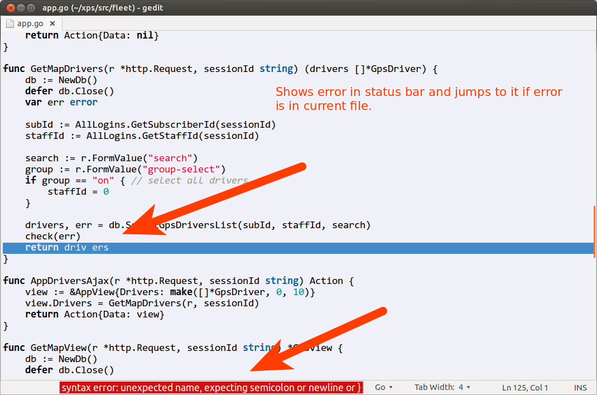
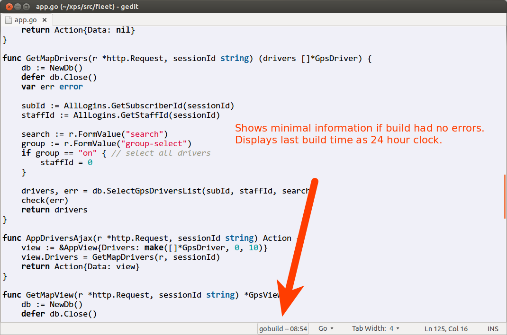
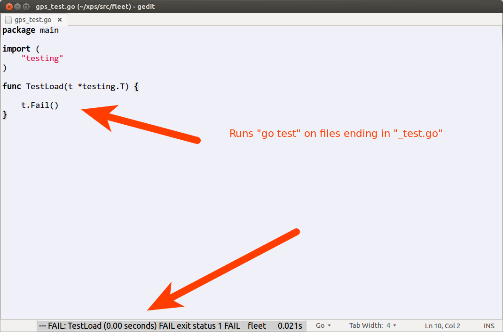

gedit-gobuild
=============

GoBuild - Gedit 3 plugin for Go develoment. golang 

GoBuild plugin version 1.0 for GEdit. Plugin attaches to on_save event
in GEdit for Go language files only. It does nothing for other file types.

Runs "go build" but if current filename has "_test.go" in the name 
then runs "go test" on current file's directory. Waits for number of seconds 
and then timeouts if process takes way too long, so GEdit would no freeze.

Current build directory is determined based on current open file directory.

 * Plug-in designed for fast development on small to mid size projects.
 * Not designed for large Go projects because compilation will timeout if it 
takes too long.
 * Not designed for Go unit tests that take long time to run.

Plugin captures go build errors and shows them in the Gedit status bar.
It also jumps to the first error and highlights error line if error is in 
the current file.

Shows last successful build.

Shows "go test" failures.

Known issues 
------------

Has been tested on Ubuntu 13.04 and 13.10.

Ubuntu 13.10 requires small change in the gobuild.plugin.
Line with python should be changed to python3 like below:

Loader=python3

This is because Gedit seems to default on using python 3 instead of 
python 2.7 on newer versions of Linux.

Usage
-----

 * Simply drop files into ~/.local/share/gedit/plugins .
 * If this directory does not exist - create it.
 * Start GEdit
 * Open Edit-Preferences, then Plugins and check "GoBuild after save" plugin.
 
Idea
----

Plugin idea is based on the fact that Go builds are fast for even decent size
projects. Because build is fast plugin can run on every Save and still appear 
responsive.
Go development with this plugin goes into tight iteration of save-edit-save-edit
cycle. 

If you work on Go projects with build times over 5 seconds this plugin should be
modified to use keyboard shortcut (such as 'F5') instead of on_save action.

Ops, I forgot to mention...Go is **awesome**. But you probably already know that.

Update version 1.1
------------------

Fixes issues in 'go test' execution.
Increased timeout to 10 seconds to allow longer running tests.

Working with multiple Go environments
-------------------------------------

It is possible to work with multiple Go environments by simply setting GOPATH before you execute gedit.
One way to do it is by adding function listed below to .bash_aliases file. Restart your bash session.

Now you can execute something like 

$$ gg dev/myproject

Assuming you have folders dev/myproject/src under your home directory. This simple script will
set GOPATH and start gedit.

    function gg() { 
    export GOPATH=/home/your_username/$@
    echo 'path set'
    printenv | grep GOPATH
    cd /home/your_username/$@/src
    gedit > /dev/null 2>&1 &
    }

